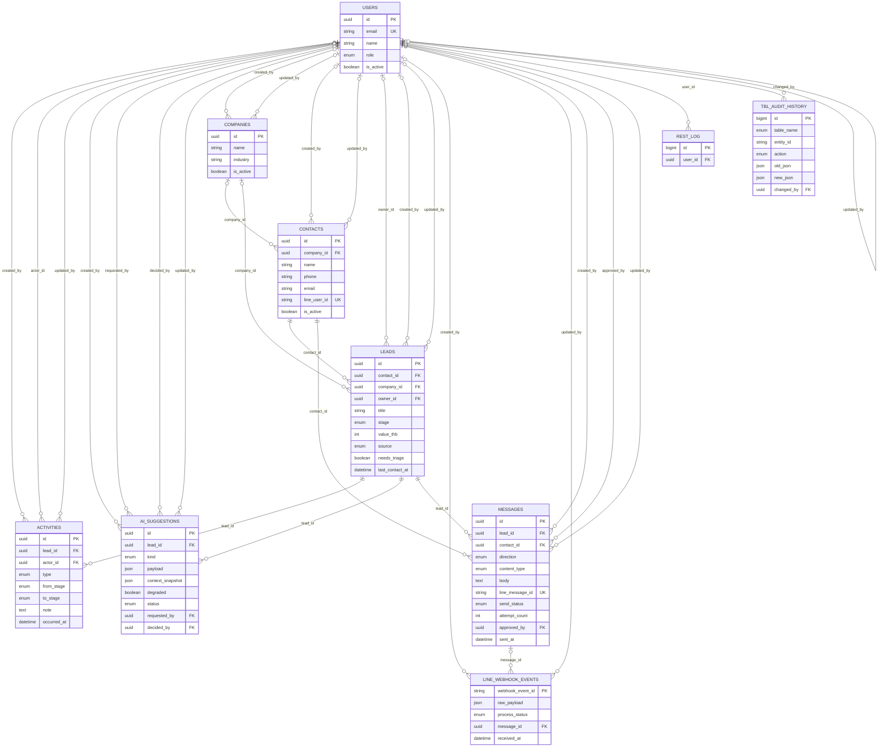

# แผนภาพความสัมพันธ์ (ERD)

สร้างอัตโนมัติจากฐานข้อมูลจริงด้วย `npm run docs:erd` ความสัมพันธ์ที่เห็นคือ foreign key ที่มีอยู่จริง
ไม่ใช่ที่ตั้งใจจะมี ให้สร้างใหม่ทุกครั้งหลังเพิ่ม migration

แผนภาพนี้แสดง**คีย์ สถานะ และคอลัมน์ที่สื่อความหมายทางธุรกิจ** เท่านั้น
คอลัมน์บันทึกเวลา ผู้แก้ไข และ snapshot JSON ถูกซ่อนไว้เพื่อให้อ่านออก
รายการคอลัมน์ทั้งหมดพร้อมคำอธิบายอยู่ใน [data-dictionary.md](data-dictionary.md)

---

## โครงสร้างและความสัมพันธ์

---

## หน้าที่ของแต่ละตาราง

| ตาราง | หน้าที่ |
|---|---|
| `users` | ผู้ใช้งานระบบ คือพนักงานขายและผู้จัดการ ไม่ใช่ลูกค้า |
| `companies` | บริษัทลูกค้า ใช้จัดกลุ่ม contact และ lead |
| `contacts` | บุคคลที่ติดต่อ คือลูกค้าหรือผู้มุ่งหวังตัวจริง |
| `leads` | โอกาสทางการขาย เป็นออบเจ็กต์แกนกลางของทั้งระบบ |
| `activities` | บันทึกเหตุการณ์ทั้งหมดของ lead คือ audit trail ระดับธุรกิจ |
| `messages` | ข้อความสนทนากับลูกค้าทั้งขาเข้าและขาออก |
| `ai_suggestions` | ผลลัพธ์จาก AI copilot ที่ยังไม่ถือเป็นการกระทำจริง |
| `line_webhook_events` | บันทึกดิบของทุก event ที่ LINE ส่งเข้ามา |
| `tbl_audit_history` | ประวัติการแก้ไขและการปิดใช้งานของทุกตารางที่ตรวจสอบ 1 การแก้ = 1 แถว |
| `rest_log` | บันทึกทุกการเรียก API ทั้งขาเข้าและขาออก ใช้ตรวจว่าหน้าจอเรียกเส้นไหนและได้อะไรกลับ |

